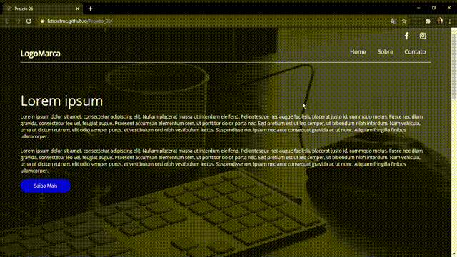

A Projeto_06 foi desenvolvido com o  objetivo de aprender mais sobre Bootstrap. Foi utilizado HTML5,CSS3 e Bootstrap. 

### Características
Esta Landing Page exibe uma maneira de mostrar seu trabalho, também pode ser adaptada a páginas de vendas. 
- Funciona em todos os tipos de telas.
- Bootstrap versão 4.3.1 
### Instalação 

Clone este repositório usando git clone https://github.com/Leticiafrnc/Projeto_06.git ou clique em Code/Download ZIP.
Clique no arquivo "index.HTML" e veja a aplicação.

### Observação: Se abrir a aplicação no celular, tablet ou qualquer tipo de tela a aplicação se adapta.

